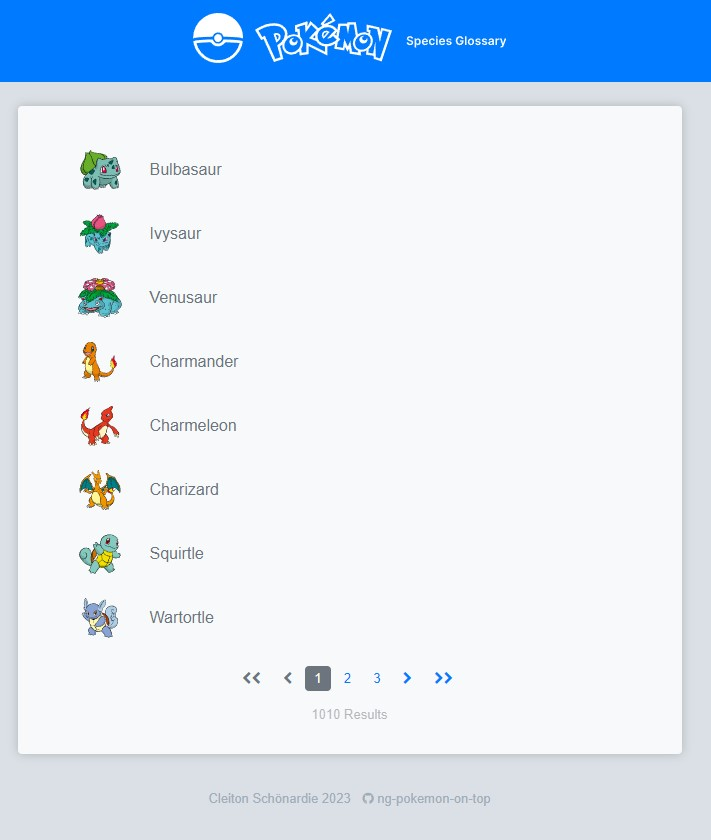
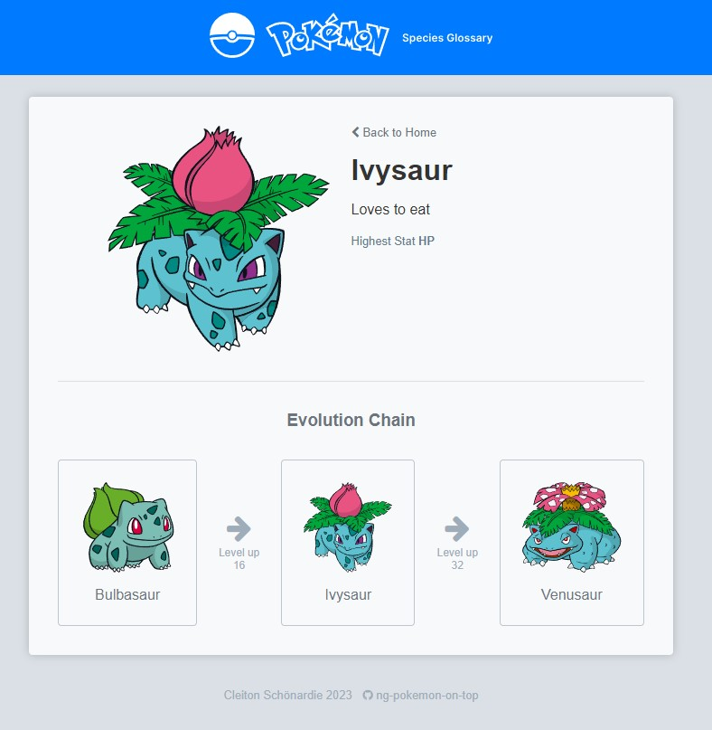

# Ontop Technical Challenge for Front End Engineers

This project consumes the Pokeapi in order to display a list of pokemon species, each with its detail page with info and their evolutions. 

Developed with [Angular CLI](https://github.com/angular/angular-cli) version 15.0.3.

## Installation 

Run `npm install` to install all the dependencies.

## Development server

Run `ng serve` for a dev server. Navigate to `http://localhost:4200/`. The application will automatically reload if you change any of the source files.

## Running unit tests

Run `ng test` to execute the unit tests via [Karma](https://karma-runner.github.io).

## Dependencies

[Pokenode-ts](https://pokenode-ts.vercel.app/): A lightweight Node.js wrapper for the PokéAPI with built-in types. 

[Font-awesome](https://fontawesome.com/): The iconic SVG, font, and CSS toolkit. 

[Ngrx](https://ngrx.io/): Reactive State for Angular.

[Axios](https://axios-http.com/): Promise based HTTP client for the browser and node.js. Pokenode-ts uses Axios to make HTTP requests.

